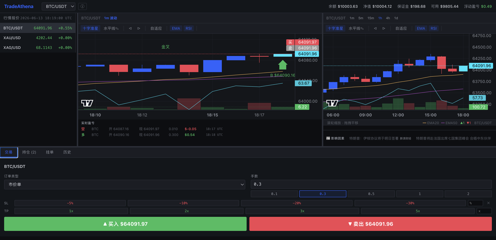

[](README.md)

# TradeAthena 量化交易终端

[](LICENSE)

专业级量化交易 Web 平台，对标 MT4/MT5。支持加密货币、黄金、白银真实行情与模拟交易，助你成为顶级量化交易员。



## 技术栈

| 语言 | 用途 | 关键依赖 |
|:---|:---|:---|
| **Rust** 🦀 | 核心撮合引擎 — 订单匹配、持仓管理、风控计算、保证金核算。全内存运算，微秒级响应。通过 PyO3 编译为 Python 原生扩展。 | PyO3 |
| **Python** 🐍 | Web API 服务层 — FastAPI 异步框架提供 REST + WebSocket 接口，行情数据聚合与推送，SQLite 持久化，Binance/黄金 API 数据源对接。 | FastAPI, SQLAlchemy, httpx |
| **TypeScript** 📘 | 前端交互逻辑 — React 组件树、状态管理、WebSocket 客户端、图表渲染控制、技术指标计算。 | React 18 |
| **CSS** 🎨 | MT5 风格深色主题 — 自定义样式变量、Flex/Grid 布局、响应式面板。 | — |

### 架构层次

```
前端 (TypeScript + React)     ← 用户交互层
       ↕ WebSocket + REST
后端 (Python + FastAPI)       ← 服务网关层
       ↕ PyO3 FFI
核心引擎 (Rust)               ← 高性能计算层
```

- **Rust 层**：热路径（撮合、风控），零 GC 延迟，全内存无锁运算
- **Python 层**：IO 密集型任务（网络请求、数据库、WebSocket 管理），利用 async/await 非阻塞
- **TypeScript 层**：UI 渲染、实时数据订阅、图表交互，利用 Vite HMR 快速开发

---

## 环境要求

- **Python** 3.10+
- **Node.js** 18+
- **Rust** (仅首次编译需要，后续不需)
- **网络** 需能访问 `api.binance.com` 和 `api.gold-api.com`

---

## 首次安装

```bash
# 1. 进入项目目录（替换为你的实际路径）
cd ~/tradeathena

# 2. 创建 Python 虚拟环境
python3 -m venv .venv

# 3. 激活环境
source .venv/bin/activate

# 4. 安装 Python 依赖
pip install -r requirements.txt
pip install maturin              # Rust 编译工具

# 5. 编译 Rust 核心引擎（需要 Rust 工具链）
export PATH="$HOME/.cargo/bin:$PATH"
PYO3_USE_ABI3_FORWARD_COMPATIBILITY=1 maturin develop --release

# 6. 安装前端依赖
cd frontend && npm install && cd ..
```

---

## 日常启动

### 方式一：一键启动

```bash
cd ~/tradeathena
bash run.sh
```

### 方式二：分别启动

**终端 1 — 后端 (端口 8000):**

```bash
cd ~/tradeathena
source .venv/bin/activate
export PATH="$HOME/.cargo/bin:$PATH"
uvicorn backend.main:app --host 0.0.0.0 --port 8000
```

**终端 2 — 前端 (端口 5173):**

```bash
cd ~/tradeathena/frontend
npm run dev
```

### 访问

| 地址 | 说明 |
|:---|:---|
| **http://localhost:5173** | 交易终端界面 |
| **http://localhost:8000/docs** | 后端 API 文档 |
| **http://localhost:8000/redoc** | API 文档(备选) |

**默认登录：** 用户名 `admin` / 密码 `admin123`

---

## 数据源

| 品种 | 数据源 | 类型 | 更新频率 |
|:---|:---|:---|:---|
| **BTC/USDT** | Binance WebSocket | 实时推送 | ~100ms |
| **XAU/USD** 黄金 | gold-api.com REST | 真实价格 | 每5分钟刷新 + 中间波动 |
| **XAG/USD** 白银 | gold-api.com REST | 真实价格 | 每5分钟刷新 + 中间波动 |

> 黄金白银在 API 刷新间隔间有微小随机波动，保持实时感。

---

## 项目结构

```
tradeathena/
├── src/                        # 🔴 Rust 核心引擎 (PyO3)
│   ├── lib.rs                 # Python 绑定接口
│   ├── types.rs               # 共享数据类型
│   └── matching.rs            # 撮合引擎 (含 5 个单元测试)
│
├── backend/                    # 🐍 Python FastAPI 后端
│   ├── main.py                # 应用入口 + 生命周期管理
│   ├── config.py              # 全局配置
│   ├── database.py            # SQLite 异步连接
│   ├── models.py              # ORM 模型 (OrderHistory, TradeHistory)
│   ├── app_state.py           # 状态注入 (统一数据源)
│   ├── routes/                # API 路由
│   │   ├── market.py          # 行情接口
│   │   ├── orders.py          # 订单接口
│   │   ├── account.py         # 账户接口
│   │   └── positions.py       # 持仓接口
│   ├── services/              # 业务服务
│   │   ├── binance.py         # Binance WS 客户端
│   │   ├── market.py          # 行情聚合
│   │   ├── gold_client.py     # 黄金白银客户端
│   │   └── symbol_info.py     # 品种信息
│   └── ws/                    # WebSocket 连接管理
│       └── manager.py
│
├── frontend/                   # ⚛️ React + TypeScript 前端
│   ├── src/
│   │   ├── components/        # MT5 风格 UI 组件
│   │   │   ├── TopBar.tsx     # 顶部工具栏
│   │   │   ├── MarketWatch.tsx# 行情列表
│   │   │   ├── TradingChart.tsx # K线图表
│   │   │   ├── OrderPanel.tsx # 下单面板
│   │   │   ├── OrderBook.tsx  # 深度行情
│   │   │   ├── PositionsTable.tsx # 持仓表
│   │   │   ├── OrdersTable.tsx # 挂单表
│   │   │   ├── HistoryTable.tsx # 历史记录
│   │   │   ├── AccountInfo.tsx # 账户信息
│   │   │   ├── LoginPage.tsx  # 登录页
│   │   │   ├── TradingPage.tsx # 主交易页面
│   │   │   └── ErrorBoundary.tsx # 错误边界
│   │   ├── utils/
│   │   │   └── indicators.ts  # 技术指标计算
│   │   ├── styles.css         # 深色主题样式
│   │   ├── api.ts             # REST API 客户端
│   │   ├── websocket.ts       # WebSocket 客户端
│   │   └── types.ts           # TypeScript 类型
│   └── package.json
│
├── Design.md                   # 设计文档
├── README.md                   # 本文档
├── run.sh                      # 一键启动脚本
├── Cargo.toml                  # Rust 配置
└── pyproject.toml              # Python 构建配置
```

---

## 功能特性

| 功能 | 支持 | 说明 |
|:---|:---|:---|
| K线图表 | ✅ | 1m/5m/15m/30m/1h/4h/6h/12h/1d/1w |
| 实时推送 | ✅ | Binance WS + WebSocket 直推前端 |
| K线颜色区分 | ✅ | 形成中: 青/紫 已收定: 蓝/红 |
| 做多/做空 | ✅ | Rust 引擎双向支持 |
| 市价单/限价单/止损单 | ✅ | 三类型订单 |
| 止损止盈 SL/TP | ✅ | 百分比快速设置 (-10%~-50% + 1x~5x) |
| EMA20/50 均线 | ✅ | 可切换显示/隐藏 |
| RSI 指标 | ✅ | 14周期，超买超卖线 |
| 水平线画线 | ✅ | 点击放置，可清除 |
| 进出场箭头 | ✅ | 自动标注开仓/平仓 |
| 买卖价参考线 | ✅ | 红色=AsK 灰色=Bid |
| 深度行情 | ✅ | OrderBook 买卖盘 |
| 账户管理 | ✅ | 余额/净值/保证金/杠杆 |
| 交易历史 | ✅ | SQLite 持久化 |
| 深色主题 | ✅ | MT5 风格专业主题 |
| 可拖拽面板 | ✅ | react-resizable-panels |
| 登录页 | ✅ | admin / admin123 |
| 品种信息 | ✅ | 交易时间/交易所/杠杆限制 |
| 错误边界 | ✅ | React 崩溃捕获不黑屏 |

---

## 品种交易时间 (北京时间)

| 品种 | 交易所 | 交易时间 | 休市 |
|:---|:---|:---|:---|
| **BTC/USDT** | Binance | 🟢 24h × 7天 | 无休市 |
| **XAU/USD** | COMEX | 🟡 周一06:00→周六05:00(夏令时) | 每日05:00-06:00 |
| **XAG/USD** | COMEX | 🟡 周一06:00→周六05:00(夏令时) | 每日05:00-06:00 |

---

## 注意

1. **持仓数据** 在 Rust 引擎**内存**中，服务器重启后持仓清零。历史记录持久化不丢。
2. **黄金白银** 每 5 分钟从 gold-api.com 刷新真实价格，期间有微小随机波动以保持实时感。
3. **代理/翻墙** 环境下可能需要配置 SSL，代码已内置处理。
4. **首次启动** 需要编译 Rust，后续启动不需要 Rust 工具链。

---

## 🎯 量化交易之道

### 交易原则

1. **保住本金第一** — 永远不要让单笔亏损超过总资金的 2%
2. **顺势而为** — 不要逆着大趋势开仓，趋势是你的朋友
3. **计划你的交易，交易你的计划** — 进场前定好止损止盈，严格执行
4. **盈亏比思维** — 每笔交易的风险回报比至少 1:2 再出手
5. **少即是多** — 减少交易频率，提高胜率，等待高概率机会
6. **永远不要扛单** — 止损是交易员的保险，不设止损等于裸奔
7. **记录每一笔交易** — 不记录的交易等于没做，复盘是进步的阶梯

### 主要风险

| 风险类型 | 说明 | 应对措施 |
|:---|:---|:---|
| 📉 **市场风险** | 价格朝不利方向剧烈波动 | 严格止损、控制仓位 |
| ⚡ **流动性风险** | 极端行情下无法按预期价格成交 | 避开数据发布前后交易 |
| 🔗 **杠杆风险** | 高杠杆放大亏损速度 | 杠杆不超过 20x |
| 🌐 **黑天鹅事件** | 突发政治、经济事件导致市场崩溃 | 分散品种、不满仓 |
| 🤖 **系统风险** | 软件/网络故障导致无法交易 | 保证网络稳定，做好备用方案 |

### 顶级交易员的优秀品质

> **"交易不是关于对错，而是关于你如何处理错误。"**

| 品质 | 描述 |
|:---|:---|
| 🧊 **纪律性** | 严格遵循交易系统，不凭感觉交易 |
| 🎭 **情绪稳定** | 亏损时不恐慌，盈利时不贪婪 |
| 📊 **数据分析能力** | 从历史数据中发现规律，而不是凭"感觉" |
| 🔄 **持续学习** | 市场永远在变，保持学习和适应 |
| 🕰️ **耐心** | 等待属于自己的机会，不是每波行情都要抓住 |
| 📝 **复盘习惯** | 每周复盘交易记录，找出错误和盲点 |

### 使用本软件进行模拟练习

**在投入真金白银之前，建议完成以下模拟训练：**

1. **基础阶段（100次交易）**：熟悉软件操作，掌握下单、平仓、止损止盈设置
2. **策略阶段（300次交易）**：制定一套简单的交易规则（如 EMA 金叉做多、死叉做空），严格执行
3. **优化阶段（500次交易）**：基于复盘数据优化策略参数，测试不同周期和指标组合
4. **心理阶段（200次交易）**：模拟真实资金量（建议 $100,000），体验大额浮亏时的心理压力

> 💡 **提示**：点击"重置账户"可一键恢复初始资金，无需重启服务即可开始新一轮模拟。

---

## ☕ 赞助

如果这个项目对你有帮助，可以请作者喝杯咖啡 ☕


